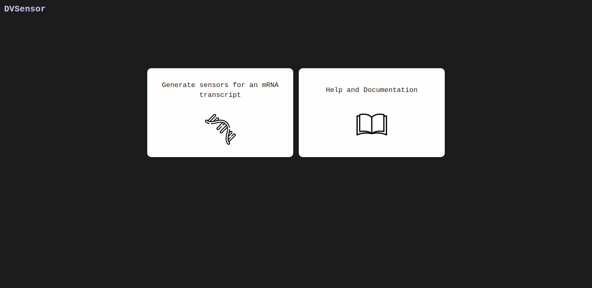
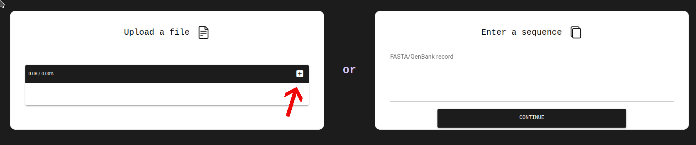
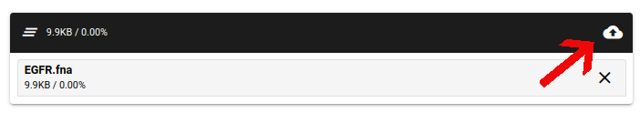
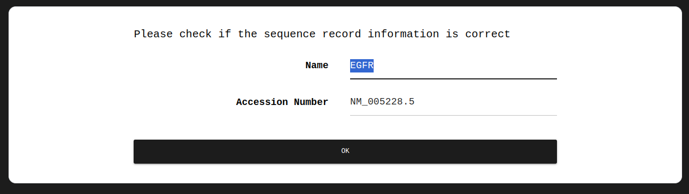
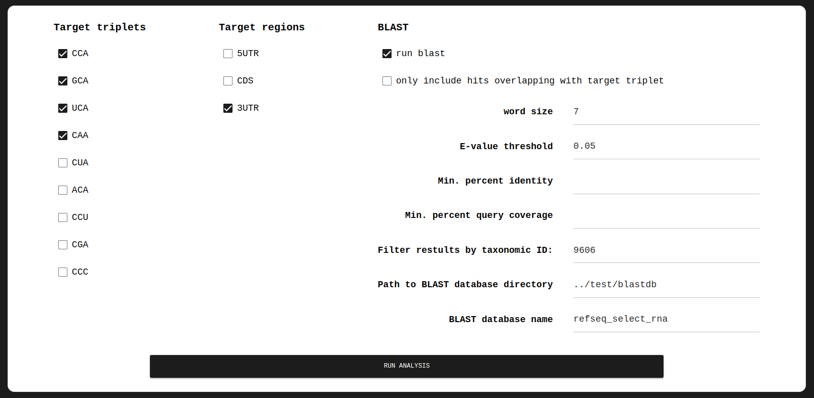
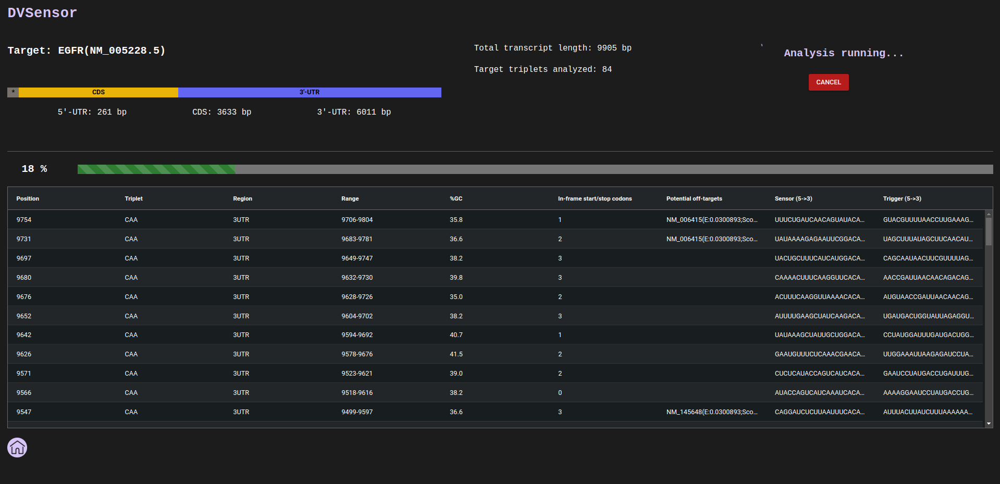
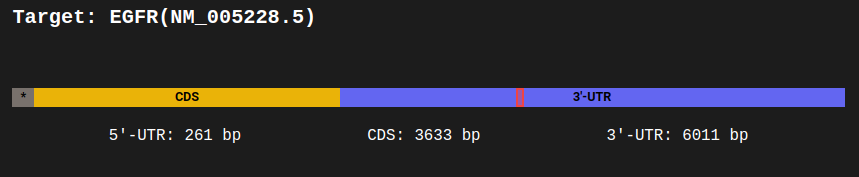
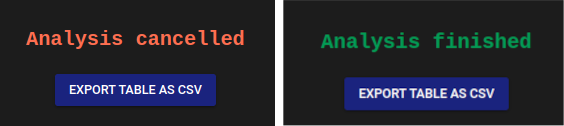

# DVSensor – a tool for creating DART VADAR Sensors

This software tool was created by the Bielefeld-CeBiTec team for the [2023 iGEM competition](https://igem.org/).

## Description
DVSensor is a software tool which allows you to create DART VADAR sensors for any mRNA targets. DART VADAR sensors, 
first described by Gayet et al. (Gayet, R.V., Ilia, K., Razavi, S. et al. Autocatalytic base editing for RNA-responsive 
translational control. Nat Commun 14, 1339 (2023). https://doi.org/10.1038/s41467-023-36851-z), are mRNA constructs 
which facilitate conditional mRNA translation based on the 
detection of target mRNA molecules. The DART VADAR mRNA can only be translated after it hybridizes with its target 
mRNA, which activates the sensor and allows the translation of an encoded payload gene. DVSensor takes a target mRNA 
sequence as input, either in FASTA or GenBank format, and generates possible DART VADAR sensor sequences as output. 
The sensor sequences can then be cloned into a suitable DART VADAR expression vector, such as our pASTERISK. The 
software offers a variety of settings for controlling how the sensors are generated. In addition, it comes with a 
built-in feature for evaluating the specificity of the generated sensor sequences. By querying mRNA databases using 
BLAST, it can identify potential off-target mRNA transcripts other than the intended target that may also be able to 
activate the sensor. A menu for documentation and help is available in the software as well. DVSensor runs locally as 
a web app inside the browser and is available for both Linux and Windows. Alternatively, it could also be hosted on 
a web server.  

This README only gives a brief summary over the installation and usage. For a thorough documentation including
a troubleshooting guideline, visit the
[Software](https://2023.igem.wiki/bielefeld-cebitec/software) page on the iGEM Bielefeld-CeBiTec 2023 team wiki.

## Installation
See the [team wiki](https://2023.igem.wiki/bielefeld-cebitec/software) for more information on installing
the software.   

There are two options for downloading and running the software. The easiest way is to download a bundled
version of the app, which comes with all the dependencies and libraries needed so they don't have to be installed.
You can find archives in the "dvsensor/bundle" directory for Linux (x86_64) or Windows (x86_64).
Extract the archive and run the executable "dvsensor" file within the directory.

You can alternatively download the source code (located in "dvsensor/src") and run it with the command
"python main.py". A working Python installation (>= 3.11) and the nicegui (>= 1.3.9) and biopython (>= 1.81)
packages are required as dependencies.

In order to use the BLAST feature of DVSensor, a working system installation of BLAST as well as a BLAST mRNA
database are required. These can be obtained from the 
[NCBI website](https://blast.ncbi.nlm.nih.gov/doc/blast-help/downloadblastdata.html). An installation guide can 
be found on the [team wiki](https://2023.igem.wiki/bielefeld-cebitec/software).

## Usage
1. Start the application (...)

2. Open a web browser of your choice and enter this url: http://localhost:8080. You should now see the start page of 
the web app (see image below). **Note:** closing or reloading the browser window will shut down the application. This is 
intended behavior, but requires a restart of the application. You should only use the buttons inside the application 
window to navigate between pages, and not the back/forward buttons of your browser.

3. You are presented with two large buttons which allow you to generate new sensors or read the documentation, 
respectively. Click on the right button to open the documentation, or the left button to upload an mRNA target
sequence.
  

4. Upload your target mRNA sequence, either as a FASTA or GenBank record. You can upload a file or paste the
sequence record manually. A maximum record size of 500MB can be uploaded.  
  

To upload a file, click on the plus button in the right corner. Select a file and click the upload button. 
To manually enter a sequence, paste the sequence into the text field and click "continue".  
  

5. The sequence name and NCBI accession number are extracted from the uploaded sequence record. Usually, the sequence 
name gets interpreted as the accession number, which may not be desired. Therefore, you can change both the sequence 
name and accession number. Changing the name has no effect on the computation or the results, but the 
accession number has to be correct in order for BLAST queries to work properly. Click "OK" when you are done.  
  

6. The next menu provides different options for controlling how the sensors are generated and for controlling the BLAST 
queries. The different options are explained on the [team wiki](https://2023.igem.wiki/bielefeld-cebitec/software). 
Click "Run Analysis" when the desired options have been set
  

7. The application will locate the selected triplets inside the selected transcript regions, and generate 123 bp 
sensors centered on those triplets. If the "run blast" option was selected, the trigger sequences (the segments of 
the target mRNA that are centered around a given triplet) will be queried against the specified database using BLAST 
to identify potential mRNA transcripts that may produce an off-target sensor activation. The results are reported 
in a table. The content of the output table is explained in more detail on the 
[team wiki](https://2023.igem.wiki/bielefeld-cebitec/software).
  

In the upper left corner, the target mRNA is depicted as a simplified ideogram, with the sizes of the different 
regions corresponding to their relative lengths. Selecting an entry in the table displays a red window in the 
ideogram, which indicates the region in the mRNA that is targeted by that particular sensor.
  

The "cancel" button in the upper right corner allows you to cancel the running analysis. When the analysis is finished 
or if it was cancelled, a new button appears, which allows you to download the output table as a CSV file.  
  

Clicking the "home" button in the lower left corner brings you back to the start page.  

## Contributing
This software will not be maintained on this GitLab repository beyond the duration of the iGEM 2023 competition.  
A clone of this repository can be found on github (...), which may or may not be maintained in the future.  
Since this software is licensed under the MIT license, you are free to copy, modify, and distribute
it without restriction. 

## Authors and acknowledgment
The software was developed by Daniel Prib (contact: dpx0@mailbox.org, github: https://github.com/dpx0).  
The following image assets used in the software were obtained from [flaticon.com](https://www.flaticon.com/)
under a free-to-use license:  
[Arrow icon created by Kirill Kazachek - Flaticon](https://www.flaticon.com/free-icons/arrow)  
[Book icon created by Good Ware – Flaticon](https://www.flaticon.com/free-icons/book)  
[Duplicate icon created by Phoenix Group – Flaticon](https://www.flaticon.com/free-icons/duplicate)  
[Document icon created by Freepik – Flaticon](https://www.flaticon.com/free-icons/document)  
[Home button icon created by Freepik – Flaticon](https://www.flaticon.com/free-icons/home-button)  
[Rna icon created by Freepik - Flaticon](https://www.flaticon.com/free-icons/rna)  
[Rna icon created by Rakib Hassan Rahim - Flaticon](https://www.flaticon.com/free-icons/rna)  

